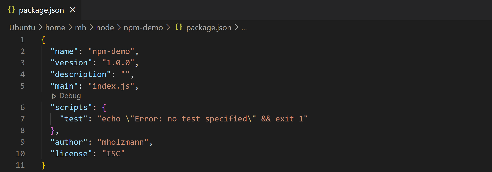
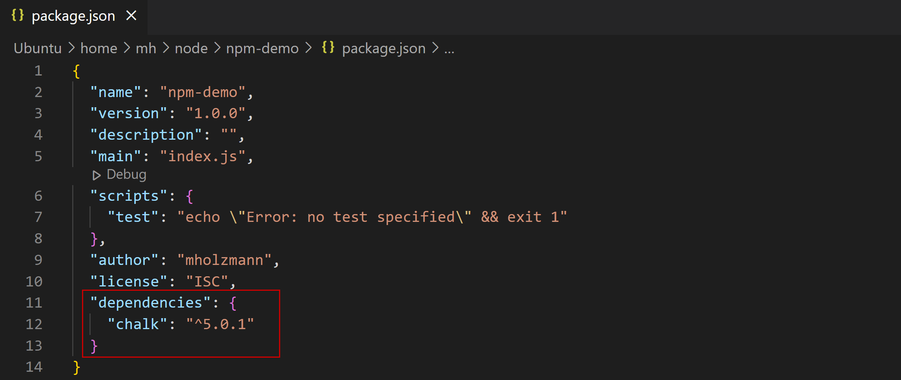

# Introduction to `npm`

## What is `npm`?

- formally called _Node Package Manager_
- consists of three components
  - [website](https://www.npmjs.com)
    - description of available packages
  - registry
    - contains all packages which are described at the website
  - client app
    - Command Line Interface (CLI) for managing packages
    - automatically installed with `Node.js`

## What do you do with `npm`?

- manage your project
  - author
  - version number
  - …
- manage your project dependencies
  - install packages
  - uninstall packages
  - update packages
- publish your own project to `npm` registry

## Project dependencies

- following problems have to be solved in every software, which depends on other libraries:

  - How to define which dependencies the application needs?
  - How to find out if dependencies should be updated?
  - How to reinstall dependencies on a target machine?

- `npm` solves those problems with the file `package.json`

## Create a `package.json`

- create an empty directory called `npm-demo`
- open the directory in your terminal

- run the following command:

  ```bash
  $ npm init
  ```

- answer the questions (or just hit enter to accept default)

- as a result a file called `package.json` will be created:

  

## Install _Chalk_ package

- [Chalk](https://www.npmjs.com/package/chalk) is a package for formatting your console output.

- you can install it via npm:

  ```bash
  $ npm install chalk
  ```

- you can check the installed _Chalk_ version with following command:

  ```bash
  $ npm list --depth=0
  ```

- additionally you will find a dependency of _Chalk_ in `package.json`:

  

## Excurse: Semantic Versioning

- Version number MAJOR.MINOR.PATCH
- `5.0.1` means

  - MAJOR=5
  - MINOR=0
  - PATCH=1

- increment …
  - MAJOR version when you make incompatible API changes
  - MINOR version when you add functionality in a backwards compatible manner
  - PATCH version when you make backwards compatible bug fixes

You can find more details at [semver.org](semver.org).

## Dependency versions in `package.json`

- `5.0.1` means

  - take version 5.0.1

- `~5.0.1` means

  - take most recent 5.0.x version

- `^5.0.1` means
  - take most recent 5.x.x version

## Import the installed _Chalk_ package

- create a file `index.js` with following content:

  ```javascript
  const chalk = require("chalk");
  console.log(chalk.red("Hello world"));
  ```

- afterwards run:

  ```bash
  $ node index.js
  ```

## Install and excecute _Cowsay_ package

- [Cowsay](https://www.npmjs.com/package/cowsay) is a package for showing a configurable talking cow

- run:

  ```bash
  $ npm install cowsay
  ```

- the above command ...

  - installs the _Cowsay_ to `node_modules/cowsay`
  - Installs executables for `Cowsay` to `node_modules/.bin`

- you can execute it with following command:

  ```bash
  $ ./node_modules/.bin/cowsay "Hello world!"
  ```

- but the preferred way for executing a package is by using `npx`:

  ```bash
  $ npx cowsay "Hello world!"
  ```

## `NODE_MODULES` folder

- all locally installed packages are stored in `NODE_MODULES`

  - ... and their dependencies
  - … and the dependencies of the dependencies...

- run following command for seeing all installed packages:

  ```bash
  $ npm list
  ```

- `NODE_MODULES` can contain large number of files

  - don't copy it from machine to machine
  - never (!!!) add it to Git repository
  - therefore add it to the `.gitignore` file

## `package-lock.json`

When a package is installed, or when `npm install` is called in an empty folder containing a `package.json` file, you will note that the file `package-lock.json` is created, besides node_modules.
The purpose of this file is following:

- The currently latest matches of the dependencies as given in `package.json` are downloaded into `node_modules` and written into `package-lock.json`.
- If you add this file to your git repository, all your team mates will use exactly the same library versions on their local machines after pulling the repo and calling `npm install`, even if there would be newer library versions available meanwhile.

### npm update

If you want to upgrade your project to newer library versions, use `npm update`. This will also update your `node_modules` as well as the `package-lock.json` file.
