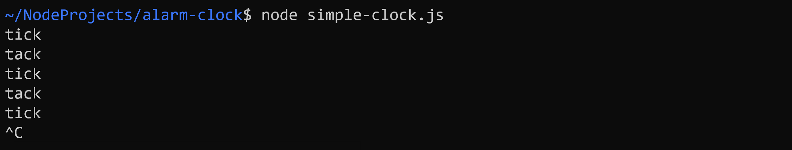
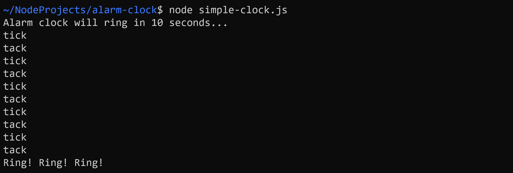
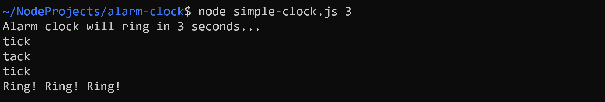
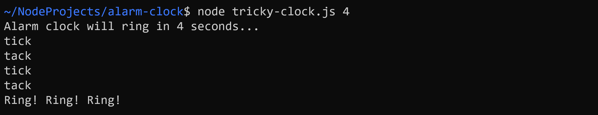

# Alarm Clocks

Ziel dieser Übung ist die Entwicklung von zwei Wecker-Applikationen mithilfe von `setInterval()` und `setTimeout()`.

## Task 1: Simple Clock

Implementieren Sie in der Datei `simple-clock.ts` die Funktion `tickOrTack(tick: boolean): void`. Diese soll (abhängig vom Parameter `tick`) entweder *tick* oder *tack* auf der Konsole ausgeben. 

Rufen Sie `tickOrTack()` in einer anonymen Funktion auf, die einmal pro Sekunde ausgeführt wird. 

**Achtung:** Pro Sekunde soll nur ein Wort ausgegeben werden (**nicht** *tick* **und** *tack*)!

**Tipp:** Ihre Applikation würde derzeit endlos weiterlaufen. Mit der Tastenkombination "Ctrl + C" (Windows) bzw. "Command + ." (Mac OS) können Sie ein Node-Programm jedoch jederzeit abbrechen.

## Task 2: Alarm

Erweitern Sie die anonyme Funktion, so dass der Wecker nach 10 s läutet und das Programm anschließend beendet wird. Verwenden Sie hierfür eine Variable `runtime` also Sekundenzähler. Verzichten Sie bis **Task 4** auf die Verwendung von `setTimeout()`. 

## Task 3: Adjustable Alarm

Die Anzahl der Sekunden bis zum Läuten des Weckers, soll dem Programm als Parameter übergeben werden können. Falls kein Argument übergeben wird, gilt weiterhin der Defaultwert von 10 s.

## Task 4: Tricky Clock

Entwickeln Sie in der Datei `tricky-clock.ts` eine Wecker-Applikation mit der gleichen Funktionalität wie zuvor. Die neue Anwendung soll jedoch ohne die Funktion `tickOrTack()` bzw. einen Sekundenzähler wie `runtime` auskommen.

Implementieren Sie stattdessen die Funktion `tick()`, die einmal *tick* auf der Konsole ausgibt, und analog die Funktion `tack()`.

Verwenden Sie anschließend `setInterval()` und `setTimeout()`, um das gewünschte Verhalten zu erreichen.

