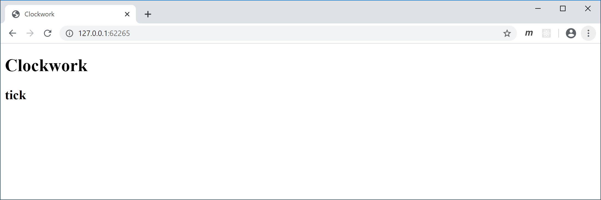
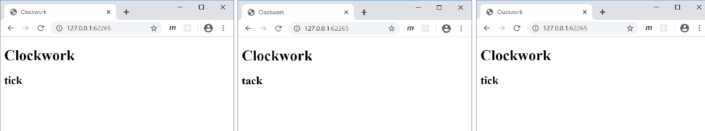
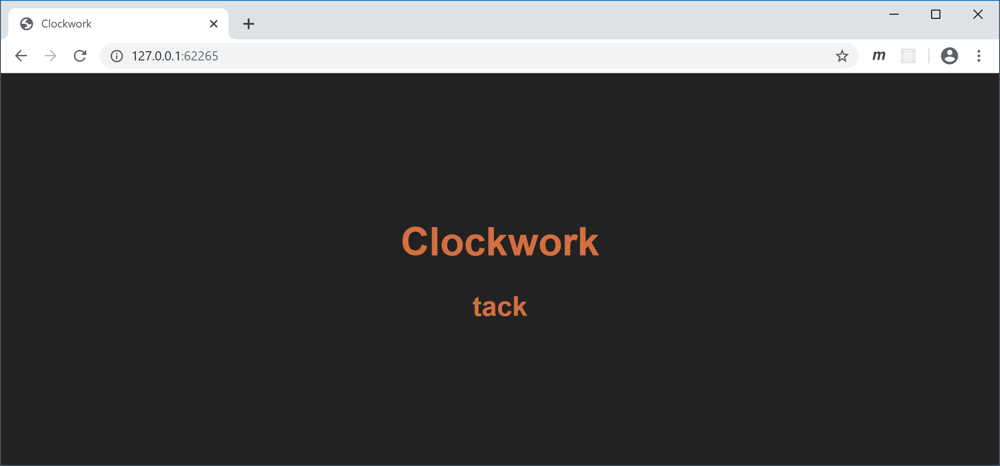

# Client Clock

Die Funktionen `setTimeout()` und `setInterval()` sind keine Besonderheit von *Node.js*, sondern stehen auch in clientseitig ausgeführtem JavaScript zur Verfügung. Auch hier (im Browser) verhalten sich diese Funktionen nicht-blockierend und asynchron.

## Task 1: Static File Server

Legen Sie einen Ordner `public` an und erstellen Sie darin die Datei `index.html` mit folgendem `<body>`-Inhalt:

```html
<div>
    <h1>Clockwork</h1>
    <h2 id="tick-tack">tick</h2>
</div>
```

Richten Sie sie anschließend einen statischen Fileserver ein:

- Projekt initialisieren: `npm init`
- Ordner `node_modules` in neue Datei `.gitignore` eintragen 
  - Wichtig: `.gitignore` nicht im Unterordner `public` sondern im *Rootverzeichnis* des *Repositories* speichern
- Package `serve` installieren: `npm install -D serve `
  - https://www.npmjs.com/package/serve
- Fileserver starten: `npx serve ./public`

Rufen Sie die Webseite im Browser auf:



## Task 2: Tick Tack

Erstellen Sie die Datei `public/client-clock.ts`. Betten Sie die daraus kompilierbare Datei `client-clock.js` im `<head>` der`index.html` ein. 

Implementieren Sie in `client-clock.ts` ein Programm, welches auf der Seite (jede Sekunde) abwechselnd *tick* oder *tack* ausgibt: 



## Task 3: Clockwork Orange

Erstellen Sie die Datei `public/style.css` und betten Sie diese im `<head>` der `index.html` ein. 

Passen Sie die HTML-Datei und die CSS-Datei an, sodass die Inhalte farbig und (unabhängig von der Fenstergröße) zentriert dargestellt wird. Die Schriftgröße soll ebenfalls von der Fenstergröße abhängen.

