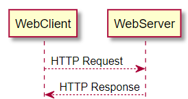

# Node Express Web Services

## HTTP Protocol - History

- **Tim Berners-Lee** is the founder of the _World Wide Web_. 
- Together with his team at the _CERN_, he developed **HTML** and the first **http** prototype.
- Today, he is chairman of the **World Wide Web Consortium** [W3C](https://www.w3.org/), which is responsible for all leading web standards

## HTTP/1.0 (1996)

- **HTTP/1.0** was defined in _May 1996_ in [RFC 1945](https://tools.ietf.org/html/rfc1945) by **IETF** (_Internet Engineering Task Force_).

- Basically, HTTP is a **stateless request-response** communication pattern
  - client sends a request
  - server sends a response

<!---->

> **Stateless** means, that the next request-response communication is isolated from a previous one, so no state is preserved between two HTTP requests.

<!---->

**Limitations of HTTP/1.0**

- For each request, a separate TCP/IP connection was created, resulting in **performance** issues.
- Communication was defined as clear text only, resulting in **security** and data protection issues.

## HTTP/1.1 (1999)

- [RFC 2616](https://www.rfc-editor.org/rfc/rfc2616): June 1999
- Complete definition of HTTP request methods:

| HTTP Method | Description |
| --- | ---|
| GET | Request data from server (html, css, javascript, img/multimedia assets, ...) |
| POST | Send data from client to server - e.g., for inserting a new data record in a database |
| PUT | Send update data for a specific resource from client to server - e.g. for updating an existing data record in a database |
| DELETE | Request deletion of an existing data record on the server side |
| TRACE | For connection testing and tracing purposes |
| HEAD | Like a GET request, but the server must not respond data, instead only meta information about the requested resource is sent back -> for caching and testing purposes |
| OPTIONS | Used for asking the server about its communication options |
| CONNECT | Reserved for tunneling means |

##  Current HTTP versions

- **HTTP/2 (2015)**
    - [RFC 7540](https://tools.ietf.org/html/rfc7540): May 2015
    - Optimized data transfer by using compression algorithms, sending binary coded content, sending multiple requests in one go, push methods, ...

- **HTTP/3 (2022)** 
    - [RFC 9114](https://datatracker.ietf.org/doc/html/rfc9114): June 2022
    - New transport protocol: QUIC (instead of TSL)